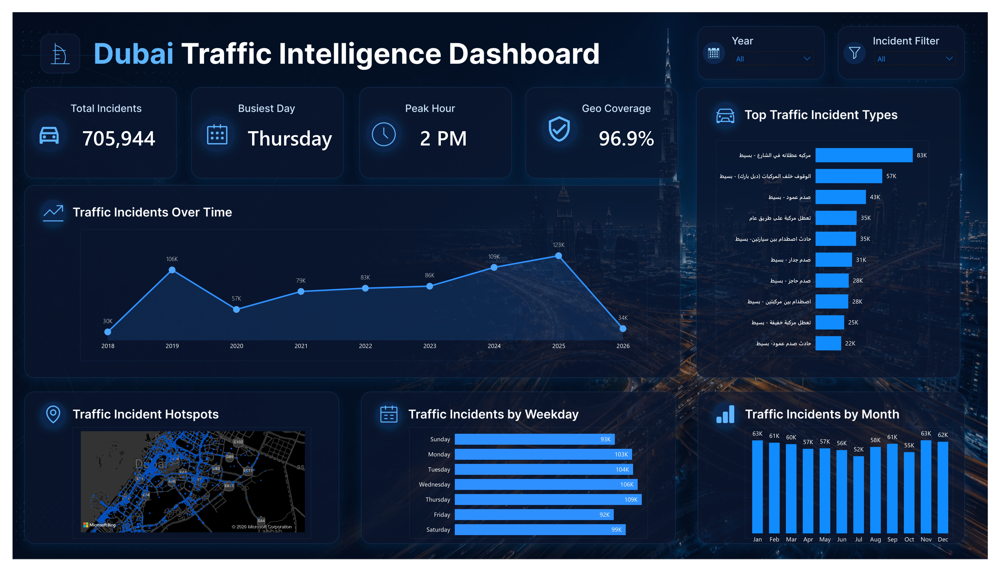

# Dubai Smart Traffic Intelligence Platform

End-to-end data analytics project on **705,944 UAE traffic incidents**, from raw open data through SQL Server ETL, dimensional modeling, and an interactive Power BI dashboard.

 

---

## Tech Stack

`SQL Server` · `Power BI Desktop` · `DAX` · `Power Query` · `Star Schema Modeling`

---

## Headline Numbers

| Metric | Value |
| --- | --- |
| Final clean fact rows | **705,944** |
| Exact duplicates removed | **667** |
| Distinct incident categories | **233** |
| Valid UAE geo coverage | **96.9%** (684,113 records) |
| Hotspot zones identified | **2,374** |
| Time span | 2018 → 2026 |

---

## Architecture

```
                        ┌──────────────────────┐
Dubai Pulse CSV ───►    │  Raw Layer (SQL)     │
                        │  Raw_Traffic_Inc_v2  │
                        └──────────┬───────────┘
                                   │ DISTINCT
                                   ▼
                        ┌──────────────────────┐
                        │  Cleaned Layer       │
                        │  clean_traffic_inc   │
                        └──────────┬───────────┘
                                   │ ROW_NUMBER() rank-based dedup
                                   ▼
                        ┌──────────────────────┐
                        │  Analytical Layer    │
                        │  Final_Clean_Traffic │
                        └──────────┬───────────┘
                                   │ split into star schema
                                   ▼
              ┌────────────────────┴────────────────────┐
              │                                         │
        ┌─────▼──────┐  ┌──────────────────┐  ┌────────▼──────┐
        │  Dim_Date  │  │ Dim_Incident_Type│  │ Dim_Geo_Zones │
        └─────┬──────┘  └────────┬─────────┘  └────────┬──────┘
              │                  │                     │
              └──────────────────┼─────────────────────┘
                                 ▼
                    ┌─────────────────────────┐
                    │ Fact_Traffic_Incidents  │
                    │       (705,944)         │
                    └────────────┬────────────┘
                                 ▼
                            Power BI
```

---

## Why Each Decision Was Made

### 1. NVARCHAR(MAX) instead of VARCHAR
The dataset has native Arabic incident descriptions. VARCHAR uses single-byte encoding and would corrupt Arabic text. NVARCHAR stores UTF-16 and preserves both Arabic and English without compromise.

### 2. CSV → XLSX before import
Opening the raw CSV produced mojibake (`صدÙ...`) because of a UTF-8 / Windows CSV mismatch. Saving as Excel preserves the encoding before it reaches SQL Server, so the encoding fix happens once at the source rather than inside every query downstream.

### 3. Nullable coordinate columns
Real-world data has gaps. Forcing NOT NULL on `acci_x` / `acci_y` would have failed the import and forced row loss decisions before any analysis. Nullable columns + later quality-aware filtering is the cleaner pattern.

### 4. Layered ETL (raw → clean → analytical)
Mirrors the medallion architecture used in enterprise data lakes. The raw layer is **immutable** if a downstream decision turns out to be wrong, I can rebuild without re-ingesting the source.

### 5. Rank-based deduplication, not blunt DISTINCT
Investigation showed duplicates weren't always identical, same `acci_id`, but one row with valid coordinates, another with NULLs. A simple DISTINCT would have lost information. Instead:

```sql
ROW_NUMBER() OVER (
  PARTITION BY acci_id
  ORDER BY
    CASE WHEN acci_x IS NOT NULL AND acci_y IS NOT NULL THEN 1 ELSE 2 END,
    load_timestamp DESC
) AS rn
```

Priority: valid coordinates first, then most recent. This is the enterprise "latest valid record" pattern.

### 6. Coordinate range validation, not coordinate fixing
3.1% of records had coordinates outside the UAE (values like `102.x`, `131.x`). Possible causes: mixed coordinate systems, GIS corruption, or upstream entry errors. Rather than guess, I isolated valid UAE records into a dedicated `Geo_Clean_Traffic_Incidents` table for mapping, and kept the full operational table for trend analysis. **No business events were silently dropped.**

### 7. Rounded coordinates for hotspot clustering
Raw GPS points are too granular for human pattern recognition, `25.216592` and `25.218111` are functionally the same location. Rounding to 2 decimals (~1.1 km grid in the UAE) creates operational zones suitable for visualization without distorting the geography.

### 8. Star schema instead of one flat table
Power BI is optimized for star schemas. One large fact table + small dimension tables = fast slicing, clean DAX, and a relationship view that explains itself. Loading dimension tables on the "one" side and the fact table on the "many" side means a single filter on `Dim_Date[weekday_name]` propagates automatically to 705K incidents.

### 9. Import mode in Power BI (not DirectQuery)
Tested DirectQuery first. Filter response was sluggish on 705K rows over a local SQL Server connection. Switched to Import, sub-second filter response, identical results.

### 10. Native Arabic labels on charts
The encoding work earlier in the pipeline was specifically so I could display Arabic incident categories without compromise. Keeping them native respects UAE stakeholders and proves the encoding chain works end-to-end.

---

## Key DAX Measures

```dax
Peak Hour =
VAR HourTable =
    SUMMARIZE(
        Fact_Traffic_Incidents,
        Fact_Traffic_Incidents[incident_hour],
        "@count", COUNT( Fact_Traffic_Incidents[incident_id] )
    )
RETURN
    MAXX(
        TOPN( 1, HourTable, [@count], DESC ),
        Fact_Traffic_Incidents[incident_hour]
    )
```

```dax
Peak Hour (Formatted) =
VAR h = [Peak Hour]
RETURN
    IF( h = 0,  "12 AM",
    IF( h < 12, FORMAT( h, "0" ) & " AM",
    IF( h = 12, "12 PM",
                FORMAT( h - 12, "0" ) & " PM" )))
```

```dax
Geo Coverage % =
DIVIDE(
    CALCULATE(
        COUNT( Fact_Traffic_Incidents[incident_id] ),
        Fact_Traffic_Incidents[latitude]  >= 22,
        Fact_Traffic_Incidents[latitude]  <= 27,
        Fact_Traffic_Incidents[longitude] >= 51,
        Fact_Traffic_Incidents[longitude] <= 57
    ),
    COUNT( Fact_Traffic_Incidents[incident_id] )
)
```

Same `SUMMARIZE → TOPN → MAXX` pattern is reused for `Busiest Day`. Reusing the pattern keeps measures predictable and easy to debug.

---

## Findings

- **Citywide peak hour: 2 PM.** Quietest: 2–5 AM.
- **Busiest day: Thursday.** Quietest: Friday.
- **Seasonality:** Nov–Feb high (cooler UAE weather, tourism); Jul–Aug low (heat, travel exodus).
- **COVID-19 dip in 2020**, full recovery by 2023.
- **Global ≠ local:** city peaks at 2 PM, but hotspot zones around 25.20° / 55.28° peak between **5–9 PM**. Local patterns and global patterns tell different stories, only visible when temporal and spatial dimensions are combined.

---

## Repository Structure

```
.
├── sql/
│   ├── 01_create_database.sql
│   ├── 02_create_raw_table.sql
│   ├── 03_data_quality_investigation.sql
│   ├── 04_cleaning_pipeline.sql
│   ├── 05_geospatial_validation.sql
│   └── 06_star_schema_build.sql
├── powerbi/
│   ├── Dubai_Traffic_Intelligence.pbix
│   └── dax_measures.md
├── docs/
│   ├── case_study.pdf
│   └── dashboard.png
└── README.md
```

---

## Running This Yourself

1. Download the [Dubai Pulse traffic incidents dataset](https://www.dubaipulse.gov.ae/).
2. Open the CSV in Excel and save as `.xlsx` to preserve Arabic encoding.
3. Run `sql/01_create_database.sql` through `sql/06_star_schema_build.sql` in order.
4. Open `powerbi/Dubai_Traffic_Intelligence.pbix` and refresh against your SQL Server.

---

## Roadmap

- [ ] Severity classification model
- [ ] Weather data join for seasonal correlation
- [ ] Forecasting layer (Power BI native or Python)
- [ ] Drill-through pages for zone and category detail
- [ ] Row-level security for multi-tenant deployment

---

## Author

Built by **Abdalla Mohamud**

[Portfolio](https://your-portfolio.com) · [LinkedIn](https://linkedin.com/in/your-handle)

Open to data analyst, BI developer, and analytics engineer roles.
